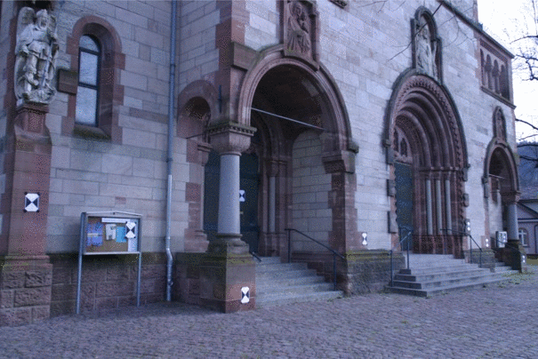
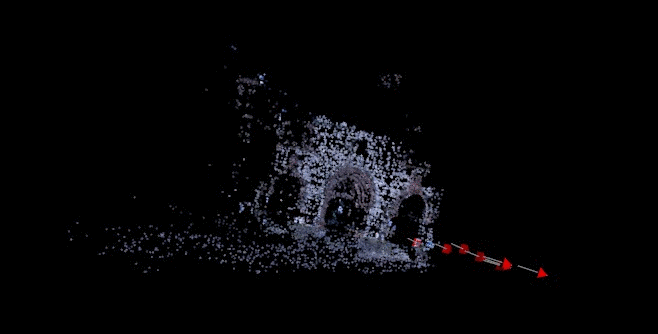

# structure-from-motion
This is an experimental project for 3D reconstruction. I follow the structure from motion project from [1], and reimplement the orignial prject from object oriented programming style to procedure programming style for easily analysing the code and learning the algorithm procedure.

## Overview
Spare 3D point cloud is produced from multiple images, the General steps of this method including:
1.	Extract dense key points and key points matching by optical flow;
2.	3D reconstruction from two view(cameras matrix estimation and triangulation )
3.	3D reconstruction from multiple view by incrementally adding new image(incremental cameras matrix estimation, triangulation and Bundle Adjustment (BA))

## Installation Dependencies
1. OpenCV v2.3 or higher(http://opencv.org/)
2. SSBA v3.0 or higher
3. The Point Clouds Library (PCL,v1.6 or higher) from "http://pointclouds.org/" for visualization

## Installation
1. install the dependence liabraies from the above section using CMake and MS Visual Studio 2013
2. Edit the property sheet opencv2413_ssba_pcl.props at the main directory 
3. Make a new project, add the property sheet and the code in the source folder

## example
The input 8 images:

Example of corresponding points estimated from two images

Constructed sparse 3D point cloud

## To be continue
1. Dense 3D point cloud reconstruction (example:http://www.di.ens.fr/pmvs/)

## References

[1] Baggio, Daniel Lélis. Mastering OpenCV with practical computer vision projects. Packt Publishing Ltd, 2012.

## Disclaimer
This work is highly based on the following repos:
1. [MasteringOpenCV/code] (https://github.com/MasteringOpenCV/code)
